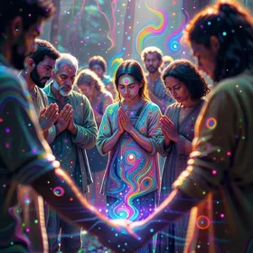
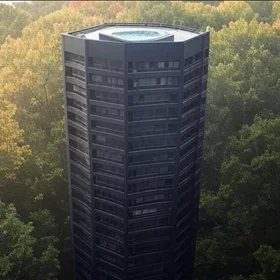
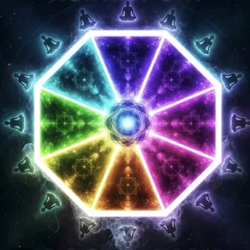
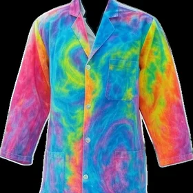
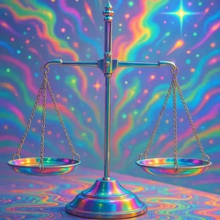

  <picture>
    <source media="(prefers-color-scheme: dark)" srcset="./assets/banner-night.svg">
    
  </picture>

  
  
  
  
  

**ORG** is a member-governed spiritual and research community. Members propose beliefs and keep the
ones most of them agree on, and together they plan octagon-shaped temples and research centers where
spirituality and science are practiced side by side. ORG was founded by Tripp Aardema.

## Enter through any door

The same nine tabs as the home page of [orgspirituality.org](https://orgspirituality.org), one perforated
sheet with ORG at its center.

<table>
  <tr>
    <td align="center"><a href="https://orgspirituality.org/about"> <b>About</b></a></td>
    <td align="center"><a href="https://orgspirituality.org/community"> <b>Community</b></a></td>
    <td align="center"><a href="https://orgspirituality.org/beliefs"> <b>Beliefs</b></a></td>
  </tr>
  <tr>
    <td align="center"><a href="https://orgspirituality.org/infrastructure"> <b>Infrastructure</b></a></td>
    <td align="center"><a href="https://orgspirituality.org/join"> <b>Join ORG</b></a></td>
    <td align="center"><a href="https://orgspirituality.org/research"> <b>Research</b></a></td>
  </tr>
  <tr>
    <td align="center"><a href="https://orgspirituality.org/legal"> <b>Legal</b></a></td>
    <td align="center"><a href="https://orgspirituality.org/future-ideas"> <b>Future</b></a></td>
    <td align="center"><a href="https://orgspirituality.org/offerings"> <b>Gifts</b></a></td>
  </tr>
</table>

## How ORG decides

Every belief starts on one member's page. Other members agree, disagree, or suggest better words, and a
belief becomes ORG's once most voting members agree. Votes never close, so any belief can be revisited.

> We think God, the universe, the Great Architect is limitless and infinite. As a result, any further
> definition would be incorrect.
>
> Belief I. Proposed by Chris. 3 of 3 members agree.

The same goes for the website itself: design changes are proposed to members and decided by vote.
[Read all nine majority-held beliefs](https://orgspirituality.org/beliefs).

## Explore

| Where | What you'll find |
| --- | --- |
| [orgspirituality.org](https://orgspirituality.org) | The official site: beliefs, community, research, and offerings. |
| [Design directions](https://org-new-look.netlify.app/) | Three proposed looks for the site, Night Sanctuary, Prism Light, and Stone & Lapis, offered to members for a vote. |
| [dApp preview](https://drasticstatic.github.io/O-R-G-dapp-public-preview/) | A playground that keeps all three looks at once: an octagon made of ORG's artwork, marbled ink you can stir, and a wallet-connect donation flow. |
| [Sidecar](https://drasticstatic.github.io/O-R-G-astro-public/) | A changelog of every notable change to ORG's sites, and a map of how they fit together. |

## Repositories

| Repository | What it holds |
| --- | --- |
| [org-frontend](https://github.com/Octagon-Religious-Research-Group-ORG/org-frontend) | The live site's code: TanStack Start on Netlify, with member sign-in, offerings, and a content editor. |
| [org-backend](https://github.com/Octagon-Religious-Research-Group-ORG/org-backend) | The API behind offerings, member profiles, and editable pages. |
| [ORG-Website](https://github.com/Octagon-Religious-Research-Group-ORG/ORG-Website) | The earlier version of the site, kept for reference. |
| [brand-assets](https://github.com/Octagon-Religious-Research-Group-ORG/brand-assets) | The octagon logo, avatar, and favicons, with usage guidelines. |
| [Octagon-Religious-Research-Group-ORG.github.io](https://github.com/Octagon-Religious-Research-Group-ORG/Octagon-Religious-Research-Group-ORG.github.io) | The organization's root page. |
| [.github](https://github.com/Octagon-Religious-Research-Group-ORG/.github) | This profile. |

## People

| | |
| --- | --- |
| **Tripp Aardema** | Founder. Leads ORG and much of the site's content and design. |
| **Renan Teixeira** ([@SCDEVBrazil](https://github.com/SCDEVBrazil)) | Develops the website and drew up the design directions. |
| **mitch8020** ([@mitch8020](https://github.com/mitch8020)) | Built the original site and its API. |
| **Christopher** ([@drasticstatic](https://github.com/drasticstatic)) | Looks after ORG's GitHub and builds the previews, with [Alfred](https://github.com/drasticstatic/anthropas-argus-alfred-public-preview). |

Where science and spirituality meet.

